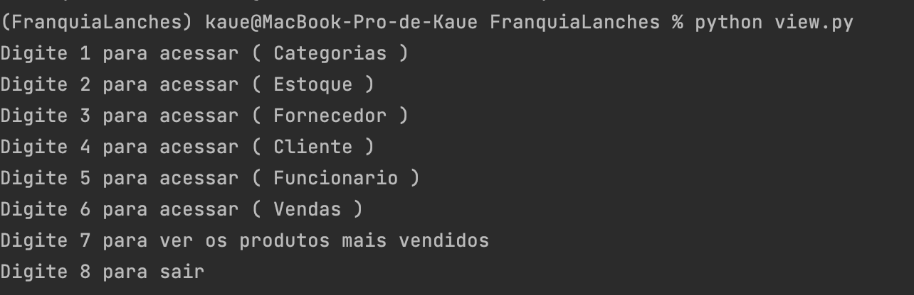

**Projeto para gestao de vendas**

projeto desenvolvido puramente em python para controle de vendas
podendo ser usado para venda diversas

para executar o projeto e bem simples

1 instalar a versao 3.9 do python

nao tem nenhuma lib especifica para se instalar tudo vem por padrao no python

para executar o o projeto basta digitir o seguinte comando 

python view.py 

em seguinte a tela ira aparecer 

Na tela a acima voce podera realizar todos os cadastros necessarios e realizar a venda do seu produto 
Isso tudo sera salvo em arquivos TXT para cansultas e log de vendas e ver produtos mais venditos 

**OBS**
Antes de realizar qualquer venda de realizar todos os cadastros 